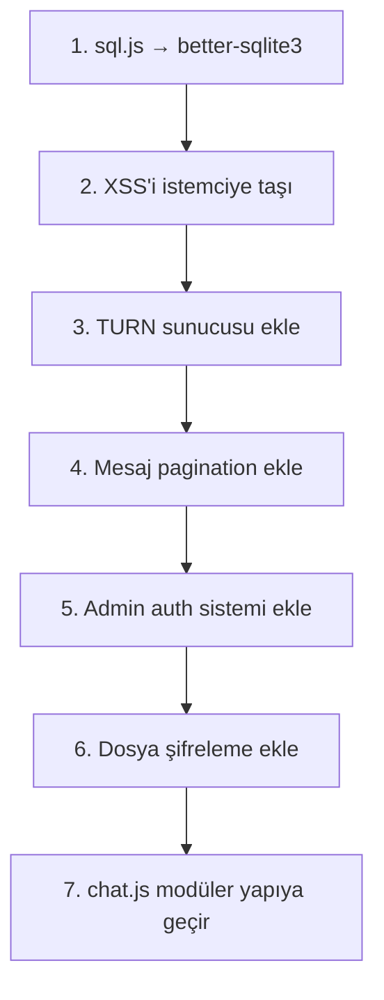

# 🔍 Haven (dc) Projesi — Kapsamlı İnceleme Raporu

> Proje: Electron masaüstü istemcisi + Express/Socket.IO backend + SQLite veritabanı  
> E2EE (Uçtan Uca Şifreleme), WebRTC (Ses/Video/Dosya), Cloudflare Tunnel

---

## 🔴 KRİTİK Sorunlar (Acil Müdahale)

### 1. Veritabanı: `sql.js` In-Memory Tehlikesi
**Dosya:** [database.js](file:///c:/Users/manya/Desktop/dc/server/database.js)

`sql.js` tüm veritabanını **RAM'de** tutar. Her mesajda `db.export()` ile tüm DB buffer'ı diske yazılır. DB boyutu büyüdükçe (50MB+) her mesaj atıldığında:
- RAM kullanımı sürekli artar (memory leak benzeri davranış)
- Her mesajda tüm verinin diske sync yazılması ciddi I/O bottleneck yaratır
- Sunucu çökerse buffer kaybolur

> [!CAUTION]
> **Çözüm:** `sql.js` yerine `better-sqlite3` kullanın. Dosya tabanlı çalışır, WAL modu ile çok daha hızlı ve güvenlidir.

---

### 2. XSS Filtresi Yanlış Konumda
**Dosya:** [server/index.js:327-333](file:///c:/Users/manya/Desktop/dc/server/index.js#L327-L333)

```javascript
// Sunucu tarafında sanitize yapılıyor AMA mesajlar E2EE ile şifreleniyor
if (msgType === 'message') {
    safeContent = sanitizeHtml(content, { ... });
}
```

Mesajlar istemcide [encryptMessage()](file:///c:/Users/manya/Desktop/dc/app/renderer/js/chat.js#155-175) ile şifrelendikten sonra sunucuya gönderilir. Sunucu sadece şifreli (Base64) metni görür — `sanitizeHtml` hiçbir işe yaramaz. 

**Gerçek tehlike:** Kötü niyetli bir kullanıcı şifrelemeden önce `<script>alert('xss')</script>` içerik oluşturabilir, bu şifreli olarak sunucudan geçer, alıcıda çözülüp `.innerHTML` ile render edildiğinde çalışır.

> [!WARNING]
> **Çözüm:** `sanitizeHtml`'i sunucudan kaldırıp, [chat.js](file:///c:/Users/manya/Desktop/dc/app/renderer/js/chat.js)'de [decryptMessage()](file:///c:/Users/manya/Desktop/dc/app/renderer/js/chat.js#176-194) sonrası istemci tarafında uygulayın.

---

### 3. Kimlik Taklidi (Identity Spoofing)
**Dosya:** [server/index.js:184-215](file:///c:/Users/manya/Desktop/dc/server/index.js#L184-L215)

Oda şifresini bilen herkes, herhangi bir `nickname` ile odaya girebilir. Başka bir kullanıcının adını taklit ederek güveni kötüye kullanabilir. Sunucu tarafında kullanıcı kimliği doğrulaması (Public Key / Digital Signature) yoktur.

---

### 4. Şifresiz Dosya Depolama
**Dosya:** [server/upload.js](file:///c:/Users/manya/Desktop/dc/server/upload.js), [chat.js:1516-1589](file:///c:/Users/manya/Desktop/dc/app/renderer/js/chat.js#L1516-L1589)

Metin mesajları E2EE ile şifrelenirken, dosyalar (görseller, PDF'ler, ses kayıtları) `/api/upload` üzerinden **şifresiz** olarak sunucuya yükleniyor ve `data/uploads/` altında açık metin hâlinde tutuluyor. Gizlilik odaklı uygulamanın tasarım felsefesiyle çelişiyor.

---

## 🟠 ÖNEMLİ Sorunlar (Yüksek Öncelik)

### 5. TURN Sunucusu Eksikliği
**Dosya:** [chat.js:2396-2403](file:///c:/Users/manya/Desktop/dc/app/renderer/js/chat.js#L2396-L2403)

```javascript
const rtcConfig = {
    iceServers: [
        { urls: 'stun:stun.l.google.com:19302' },
        { urls: 'stun:stun1.l.google.com:19302' },
        // TODO: TURN sunucusu eklenmesi gerekli
    ]
};
```

Sadece STUN sunucuları var. **Simetrik NAT** arkasındaki kullanıcılar (kurumsal ağlar, 4G/5G mobil bağlantılar) arasında WebRTC bağlantısı kurulamaz. Ses/video aramaları ve P2P dosya transferi bu kullanıcılar için çalışmaz.

> [!IMPORTANT]
> **Çözüm:** Bir COTURN sunucusu kurup `rtcConfig`'e TURN bilgileri ekleyin.

---

### 6. Mesaj Geçmişi Sayfalaması Yok
**Dosya:** [server/index.js:250-256](file:///c:/Users/manya/Desktop/dc/server/index.js#L250-L256)

```javascript
// Sadece son 100 mesaj getiriliyor, daha fazlası erişilemez
ORDER BY m.created_at DESC LIMIT 100
```

Kullanıcı yukarı scroll yapıp eski mesajları göremiyor. Pagination/infinite scroll mekanizması yok.

---

### 7. Dosya Boyutu Limiti Çok Düşük
**Dosya:** [server/upload.js:54](file:///c:/Users/manya/Desktop/dc/server/upload.js#L54)

10MB dosya limiti var. P2P üzerinden sınırsız dosya transferine izin veriliyorken, sunucu yüklemesi 10MB ile sınırlandırılmış. Video dosyaları, büyük görseller kolayca bu limiti aşar.

---

### 8. `.env` Güvenlik Sorunu
**Dosya:** [.gitignore](file:///c:/Users/manya/Desktop/dc/.gitignore)

`.env` dosyası .gitignore'da var (iyi) ama `.env` dosyasında hiçbir hassas bilgi yok (sadece PORT ve HOST). Gelecekte API anahtarları eklenirse bu yapı yeterli olacak. Ancak `server/index.js`'deki `bcrypt` salt değeri veya başka sırlar environment değişkenlerine taşınmalı.

---

## 🟡 ORTA Öncelik Sorunlar

### 9. Devasa Tek Dosya Mimarisi
**Dosya:** [chat.js](file:///c:/Users/manya/Desktop/dc/app/renderer/js/chat.js) — **3738 satır**

Tek bir dosyada şunlar bir arada:
- Socket.IO bağlantı yönetimi
- WebRTC ses/video/ekran paylaşımı
- P2P dosya transferi
- Mesaj render/DOM manipülasyonu
- Sesli mesaj kayıt/oynatma
- Ayarlar modali
- Admin paneli
- Mobil menü
- Medya önizleme (zoom/drag)
- Reaction sistemi
- Context menüler

Bu bakım ve debug işlerini kabusa çevirir. Her yeni özellik eklemek riskli hale gelir.

> [!TIP]
> **Çözüm:** Dosyayı modüllere ayırın (ör: `webrtc.js`, `chat-ui.js`, `voice-recorder.js`, `admin.js`, `settings.js`) ve bir bundler (Webpack/esbuild) kullanın.

---

### 10. Cloudflare Try Tunnels Güvenilirliği
**Dosya:** [app/main.js](file:///c:/Users/manya/Desktop/dc/app/main.js)

`trycloudflare.com` ücretsiz anonim tüneli:
- Sık sık düşer ve bağlantı kopar
- Cloudflare CAPTCHA engelleri oluşturabilir
- Rate limiting'e takılabilir
- URL her yeniden başlatmada değişir

---

### 11. Admin Panel Güvenlik Yetersizliği
**Dosya:** [server/index.js:92-101](file:///c:/Users/manya/Desktop/dc/server/index.js#L92-L101)

Admin API'si yalnızca `isLocalhost()` kontrolüne dayanıyor. Cloudflare Tunnel üzerinden gelen isteklerin IP'si `127.0.0.1` olarak görülebilir (proxy arkasında `trust proxy` açık). Bu durumda uzaktan birisi admin endpointlerine erişebilir.

```javascript
// trust proxy açık olduğu için bu kontrol güvenilir DEĞİL
app.set('trust proxy', 1);
```

> [!WARNING]
> **Çözüm:** Admin paneli için ayrı bir API token/password sistemi ekleyin.

---

### 12. Mesaj Silme Güvenlik Açığı
**Dosya:** [server/index.js:387-398](file:///c:/Users/manya/Desktop/dc/server/index.js#L387-L398)

Mesaj silme yalnızca `username` eşleşmesine bakıyor. Nickname değiştirip, önceki bir kullanıcının adını alarak onun mesajlarını silebilirsiniz:

```javascript
const isOwner = msg.username === socket.nickname || 
    (socket.userId && msg.user_id === socket.userId);
```

---

### 13. Bellek Sızıntısı Potansiyeli (WebRTC)
**Dosya:** [chat.js:2859-2918](file:///c:/Users/manya/Desktop/dc/app/renderer/js/chat.js#L2859-L2918)

- `AudioContext` nesneleri düzgün kapatılmıyor (sesli aramadan ayrılırken `audioContext.close()` çağrılmıyor)
- `volumeMeters` objeleri birikebilir
- Her `setupVolumeMeter` çağrısında yeni `MediaStreamSource` oluşturuluyor ama eski source'lar disconnect edilmiyor

---

### 14. Hata Yakalama Eksiklikleri
Birçok kritik `catch` bloğu sessizce hatayı yutarak kullanıcıya bilgi vermiyor:

```javascript
} catch (ex) { }     // chat.js:890 — P2P dosya JSON parse
} catch (e) { }      // chat.js:1037 — p2p-announce parse  
} catch (e) { }      // chat.js:2359 — YouTube URL parse
```

---

## 🔵 DÜŞÜK Öncelik / İyileştirme Önerileri

### 15. i18n Duplicate Anahtarları
**Dosya:** [i18n.js:87-98 ve 260-272](file:///c:/Users/manya/Desktop/dc/app/renderer/js/i18n.js#L87-L98)

`admin_label` anahtarı hem satır 87 hem satır 98'de tanımlı (Türkçe'de). İkincisi birincisinin üzerine yazıyor. Aynı durum İngilizce çeviride de var (261 vs 272). Ayrıca `connecting` anahtarı da duplicate (67 vs 122, 242 vs 296).

### 16. Avatar Profil Resminin Base64 Olarak Saklanması
**Dosya:** [chat.js:1950-1951](file:///c:/Users/manya/Desktop/dc/app/renderer/js/chat.js#L1950-L1951)

Profil resmi `canvas.toDataURL('image/jpeg', 0.8)` ile Base64 string'e çevriliyor ve `localStorage`'a kaydediliyor. Bu string her mesajla birlikte sunucuya gönderiliyor. Her mesajın `profile_pic` alanında ~5-15KB Base64 veri taşınması DB ve bandwidth israfına neden olur.

> **Çözüm:** Profil resmini bir kez `/api/upload` ile yükleyip, sadece URL referansını kullanın.

### 17. Hardcoded Türkçe Metinler
Birçok yerde i18n sistemi yerine doğrudan Türkçe string kullanılmış:
- `chat.js:1025` — "Yükleniyor... Lütfen sekmeyi kapatmayın."
- `chat.js:2604` — "Kaynaklar yükleniyor..."
- `chat.js:3662` — "Odalar yükleniyor..."
- `chat.js:2810` — "Ekran Paylaşılıyor"

### 18. CORS Güvenliği
**Dosya:** [server/index.js:39-46](file:///c:/Users/manya/Desktop/dc/server/index.js#L39-L46)

```javascript
origin: function (origin, callback) {
    callback(null, origin || '*'); // HER origin kabul ediliyor
}
```

Tüm originlerin kabul edilmesi, üretim ortamında CSRF/CORS saldırılarına kapı açar.

### 19. Rate Limiting `/api/upload`'a İki Kez Uygulanıyor
**Dosya:** [server/index.js:73-74](file:///c:/Users/manya/Desktop/dc/server/index.js#L73-L74)

```javascript
app.use('/api', apiLimiter);        // /api altındaki her şey (upload dahil)
app.use('/api/upload', apiLimiter); // Upload'a tekrar
```

`/api/upload` zaten `/api` altında olduğu için rate limiter iki kez çalışıyor. Bu, upload isteklerinin limitlerinin beklenenden 2x hızlı dolmasına sebep olur.

### 20. `preload.js` - Geniş IPC Yüzeyi
**Dosya:** [app/preload.js:48](file:///c:/Users/manya/Desktop/dc/app/preload.js#L48)

```javascript
openExternal: (url) => ipcRenderer.invoke('open-external-url', url),
```

`openExternal` fonksiyonu URL parametresini doğrulamadan doğrudan `shell.openExternal()`'e iletiyor. Kötü niyetli bir XSS payload'u `file://` veya `cmd://` gibi tehlikeli URL şemalarını açabilir.

---

## 📊 Özet Tablo

| #  | Kategori | Sorun | Öncelik |
|----|----------|-------|---------|
| 1  | Veritabanı | sql.js in-memory → çökme/donma riski | 🔴 Kritik |
| 2  | Güvenlik | XSS filtresi yanlış konumda (sunucu vs istemci) | 🔴 Kritik |
| 3  | Güvenlik | Kimlik taklidi (nickname spoofing) | 🔴 Kritik |
| 4  | Gizlilik | Dosyalar şifresiz saklanıyor | 🔴 Kritik |
| 5  | Ağ | TURN sunucusu eksik → P2P çalışmıyor | 🟠 Yüksek |
| 6  | UX | Mesaj pagination yok | 🟠 Yüksek |
| 7  | UX | 10MB dosya limiti çok düşük | 🟠 Yüksek |
| 8  | Güvenlik | .env yapılandırması yetersiz | 🟠 Yüksek |
| 9  | Mimari | 3738 satırlık tek dosya | 🟡 Orta |
| 10 | Altyapı | Cloudflare free tunnel güvenilirliği | 🟡 Orta |
| 11 | Güvenlik | Admin panel bypass riski (trust proxy) | 🟡 Orta |
| 12 | Güvenlik | Mesaj silme spoofing | 🟡 Orta |
| 13 | Performans | WebRTC AudioContext bellek sızıntısı | 🟡 Orta |
| 14 | Kalite | Sessiz hata yakalama blokları | 🟡 Orta |
| 15 | i18n | Duplicate çeviri anahtarları | 🔵 Düşük |
| 16 | Performans | Base64 profil resmi her mesajda taşınıyor | 🔵 Düşük |
| 17 | i18n | Hardcoded Türkçe metinler | 🔵 Düşük |
| 18 | Güvenlik | CORS wildcard origin | 🔵 Düşük |
| 19 | Bug | Rate limiter iki kez uygulanıyor | 🔵 Düşük |
| 20 | Güvenlik | openExternal URL doğrulaması yok | 🔵 Düşük |

---

## ✅ İyi Yapılmış Noktalar

| Özellik | Değerlendirme |
|---------|---------------|
| E2EE (SubtleCrypto) | ✅ Web Crypto API ile düzgün implementasyon |
| bcrypt Şifre Hashing | ✅ Oda şifreleri güvenli şekilde hashleniyor |
| UUID Dosya İsimleri | ✅ Path traversal saldırılarına karşı koruma |
| Rate Limiting | ✅ DDoS/brute-force koruması mevcut |
| i18n (3 Dil) | ✅ Türkçe, İngilizce, Kürtçe desteği |
| WebRTC Perfect Negotiation | ✅ Doğru pattern kullanılmış (polite/impolite) |
| Tepki (Reaction) Sistemi | ✅ Tooltip ile kullanıcı avatarları gösteriliyor |
| Ses Mesajı Waveform | ✅ Canvas ile görsel dalga formu çizimi |
| Theme Sistemi | ✅ CSS custom properties ile çoklu tema desteği |
| Electron Security | ✅ contextBridge + nodeIntegration:false |

---

## 🎯 Önerilen Aksiyon Planı


